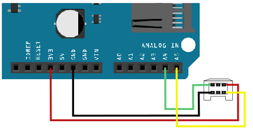

# WiiExpansions
Arduino library to control Wii Remote expansion devices.

## Features
 * Provide an interface to use Wii Remote expansion devices such as :
     * Nunchuks;
     * Classic Controlers.

## Getting started

[Download this repository](https://github.com/jlebunetel/WiiExpansions/archive/master.zip) and unzip it into the Arduino libraries folder on your computer. You should rename the folder `WiiExpansions-master` in `WiiExpansions`.


## Connexions

Wii Remote expansion devices use I2C as transportation protocol.
Simply connect it to Arduino through A4 (SDA) and A5 (CLK) pins :



### Simple example

``` c++
#include <WiiExpansions.h>

// WiiNunchuk instance creation
WiiNunchuk nunchuck;

void setup() {
  // Nunchuck initialization
  nunchuck.init();
}

void loop() {
  // nunchuck update
  manette.read();

  if(manette.A.isPressed()){
    // do something when the button A is pressed
  }
}
```


## Contributing
If you'd like to contribute, please raise an issue or fork the repository and use a feature branch. Pull requests are warmly welcome.

## Licensing
The code in this project is licensed under MIT license. See the [LICENCE](LICENCE) file for details.

## Contributors
 * **Julien Lebunetel** - [jlebunetel](https://github.com/jlebunetel)
